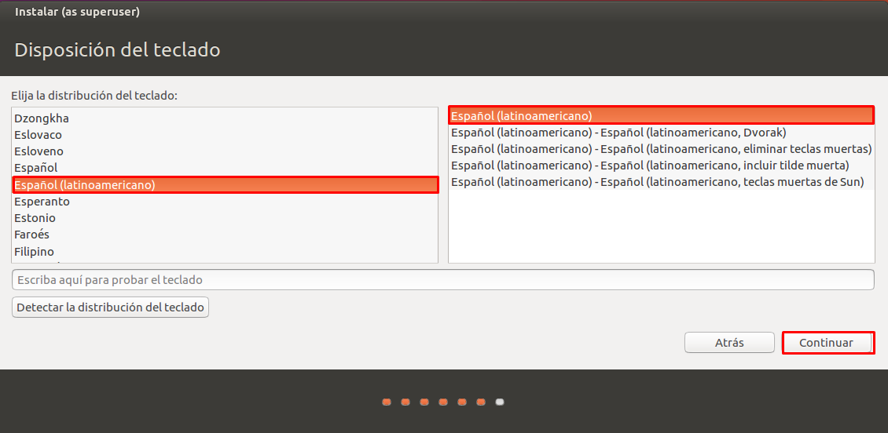

# Sistemas Operacionales - Proyecto final  
**Nombre:** Brayan Andrés Henao  - Jefry Cardona Chilito  
**Código:** A00056004 - A00320232  
**Correo:** bryanhenao96@gmail.com - jeffrykr95@gmail.com  
**URL Repositorio:** https://github.com/brayanhenao/so-project

## Máquina Virtual

### Instalación
Para este proyecto se utilizará una máquina virtual con el sistema operativo Ubuntu 16.04 LTS (Xenial). Para su instalación, se siguen estos pasos:

1. Primero se configura el hypervisor (VirtualBox en este caso) creando el disco duro, la memoria ram que le será asignada y el sistema operativo a utilizar, proporcionando la imagen ISO de este.  
  

  

  

  


2.  Una vez proporcionados los recursos, se inicia la máquina virtual y se empieza su instalación seleccionando el idioma del asistente de instalación y presionando el botón "Instalar".  

  

3.  Se selecciona "Descargar actualizaciones al instalar Ubunto" esto permitirá tener el sistema actualizado en su última versión.  


4.  Se procede a seleccionar el tipo de instalación, en este caso "Borrar disco e instalar Ubuntu" para que realice una instalación limpia en el disco desde 0.


5.  Se le pregunta al usuario cuáles son las particiones que se van a crear, y se presiona el botón continuar.


6.  Se configura la ubicación (Bogotá) y la distribución del teclado a utilizar (en nuestro caso Español latinoamericano).




7.  Por último se especifica el usuario a crear, al igual que el nombre del equipo y la contraseña de acceso a este.


### Configuración  
##### Núcleos  
Como se pide en el proyecto, se debe configurar la máquina virtual para que trabaje con 4 núcleos, así que procedemos a ir a la opción "Configuración" de la máquina virtual, en la pestaña "Sistema" y la subpestaña "Procesador".  

  

##### Interfaces de red  
Una vez instalado el sistema operativo se procede a realizar las configuraciones de red necesarias para el proyecto, habilitar las 2 interfaces de red necesarias para trabajar en el proyecto, una en modo NAT y la otra en modo Bridge (adaptador puente).  


## Instalación LXC/LXD  

Para la instalación de LXC/LXD para el usuario operativos se necesita el siguiente comando:

```console
sudo apt install lxd lxd-client
```

Una vez instalado LXC/LXD se procede a agregar al usuario operativos al grupo lxd, esto para que se puedan utilizar los comandos.
```console
usermod -a -G lxd operativos
```


Una vez se encuentra lista la herramienta LXC/LXD se procede a instalar ZFS con los siguientes comandos:
```console
sudo apt-get update
sudo apt-get install zfsutils-linux
```


##### ZFS 
ZFS gestor de volúmenes lógicos de código abierto y gratuito creado por Sun Microsystems. ZFS elimina del todo la administración de volúmenes. En vez de tener que crear volúmenes virtualizados, ZFS agrega dispositivos a una agrupación de almacenamiento. La agrupación de almacenamiento describe las características físicas del almacenamiento (organización del dispositivo, redundancia de datos, etc.) y actúa como almacén de datos arbitrario en el que se pueden crear sistemas de archivos. 

Ventajas

-Escalabilidad: Es un sistema de archivos de 128 bits capaz de gestionar zettabytes (mil millones de terabytes) de datos.  

-Máxima integridad: Todo lo que hace dentro de ZFS utiliza una suma de comprobación para garantizar la integridad de los archivos. Además, mientras ZFS está ocupado comprobando silenciosamente la integridad de sus datos, realizará reparaciones automáticas en cualquier momento que pueda.

-Drive pooling: Los creadores de ZFS hacen una analogìa de este sistema de archivos con la memoria RAM.  Cuando necesitas más memoria en tu computadora, pones otro stick y ya está.  Del mismo modo, con ZFS, cuando se necesita más espacio en el disco duro, se coloca otro disco duro y listo.  No hay necesidad de gastar tiempo particionando, formateando, inicializando, o haciendo cualquier otra cosa en sus discos - cuando necesite un "pool" de almacenamiento más grande, simplemente añada discos.

-RAID: ZFS es capaz de muchos niveles RAID diferentes, todo ello a la vez que ofrece un rendimiento comparable al de las controladoras RAID por hardware.  Esto le permite ahorrar dinero, facilitar la configuración y tener acceso a niveles RAID superiores que ZFS ha mejorado.

La arquitectura de funcionamiento de ZFS se puede apreciar a continuación:


##### Storage Pool
A diferencia de los sistemas de ficheros tradicionales que residen encima de un sólo dispositivo subyacente y por lo tanto requieren un gestor de volúmenes separado, ZFS se apoya en espacios de almacenamiento virtuales (virtual storage pools). Los espacios se construyen a partir de uno o más dispositivos virtuales, o vdevs (la forma al que se referencia cualquier tipo de dispositivo de almacenamiento, ya sea local o remoto). Un pool puede ser de tipo simple (uno o más vdevs sin redundancia), mirror (dos o más vdevs en pares, en modalidad espejo), o RAID Z (tres o más vdevs con paridad).


Siguiendo con la instalación, se configura LXD para su uso con el comando:
```console
sudo lxd ini
```
Este comando se encarga de las configuraciones iniciales para el manejo de contenedores tales como la creación del pool storage, ZFS pool y el tamaño del loop device.


Una vez realizados estos pasos llegaremos a la configuración bridge de LXD, para esto se utilizan los valores predeterminados.


Se utiliza el nombre "lxdbr0" para la interfaz bridge de LXD


Se configura la subnet mediante IPv4


Una red aleatoria fue seleccionada automáticamente


Se coloca la dirección IPv4 de la interfaz


Se coloca la máscara de la subred


Se configura la dirección inicial y final que el DHCP se encargará de manejar


Se configura el máximo de direcciones asignados por el DHCP


Por último se selecciona hacer NAT a todo el tráfico IPv4 de la interfaz


Aquí se puede apreciar la finalización exitosa del proceso de configuración de LXD


## Bibliografía

-https://www.howtogeek.com/175159/an-introduction-to-the-z-file-system-zfs-for-linux/
-https://docs.oracle.com/cd/E24842_01/html/820-2314/zfsover-2.html#scrolltoc
-https://wiki.illumos.org/download/attachments/1146951/zfs_last.pdf
-https://es.wikipedia.org/wiki/ZFS_(sistema_de_archivos)#Espacios_de_almacenamiento_(Storage_pools)
