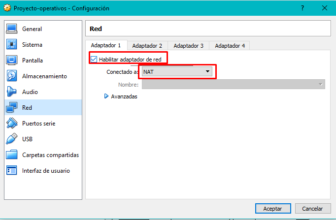

# Sistemas Operacionales - Proyecto final  
**Nombre:** Brayan Andrés Henao  - Jefry Cardona Chilito  
**Código:** A00056004 - A00320232  
**Correo:** bryanhenao96@gmail.com - jeffrykr95@gmail.com 
**URL Repositorio:** https://github.com/brayanhenao/so-project

## Máquina Virtual

### Instalación
Para este proyecto se utilizará una máquina virtual con el sistema operativo Ubuntu 16.04 LTS (Xenial). Para su instalación, se siguen estos pasos:

1. Primero se configura el hypervisor (VirtualBox en este caso) creando el disco duro, la memoria ram que le será asignada y el sistema operativo a utilizar, proporcionando la imagen ISO de este.  
  

  

  

  

2.  Una vez proporcionados los recursos, se inicia la máquina virtual y se empieza su instalación seleccionando el idioma del asistente de instalación y presionando el botón "Instalar".  

  

3.  Se selecciona "Descargar actualizaciones al instalar Ubunto" esto permitirá tener el sistema actualizado en su última versión.  

4.  Se procede a seleccionar el tipo de instalación, en este caso "Borrar disco e instalar Ubuntu" para que realice una instalación limpia en el disco desde 0.

5.  Se le pregunta al usuario cuáles son las particiones que se van a crear, y se presiona el botón continuar.

6.  Se configura la ubicación (Bogotá) y la distribución del teclado a utilizar (en nuestro caso Español latinoamericano).

7.  Por último se especifica el usuario a crear, al igual que el nombre del equipo y la contraseña de acceso a este.

### Configuración  
##### Núcleos  
Como se pide en el proyecto, se debe configurar la máquina virtual para que trabaje con 4 núcleos, así que procedemos a ir a la opción "Configuración" de la máquina virtual, en la pestaña "Sistema" y la subpestaña "Procesador".  

  

##### Interfaces de red  
Una vez instalado el sistema operativo se procede a realizar las configuraciones de red necesarias para el proyecto, habilitar las 2 interfaces de red necesarias para trabajar en el proyecto, una en modo NAT y la otra en modo Bridge (adaptador puente).  

## Instalación LXC/LXD  

Para la instalación de LXC/LXD para el usuario operativos se
