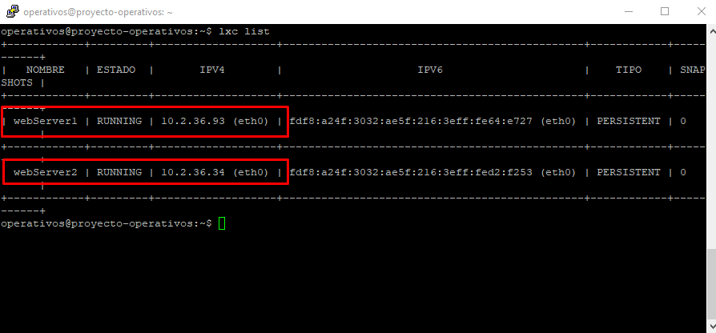
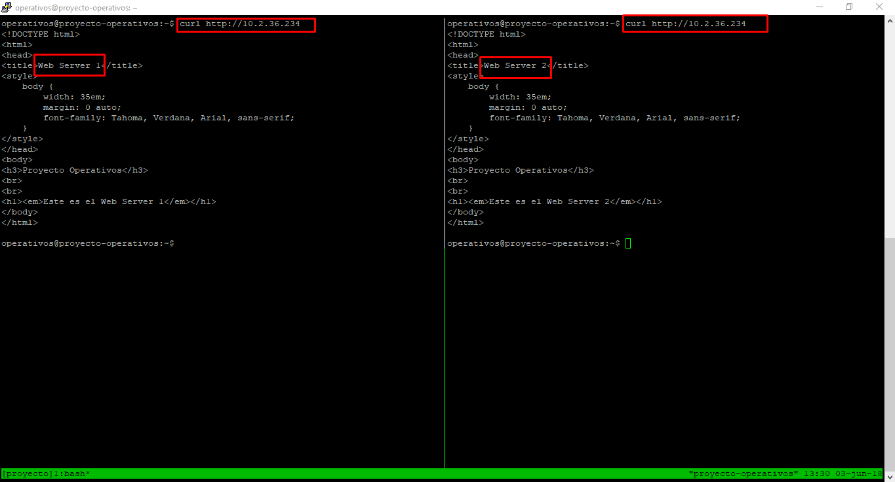
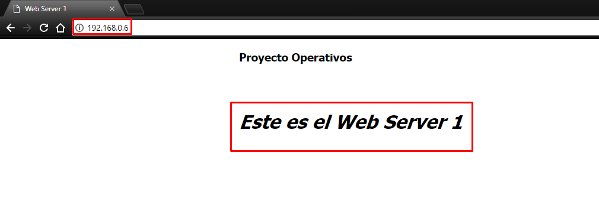
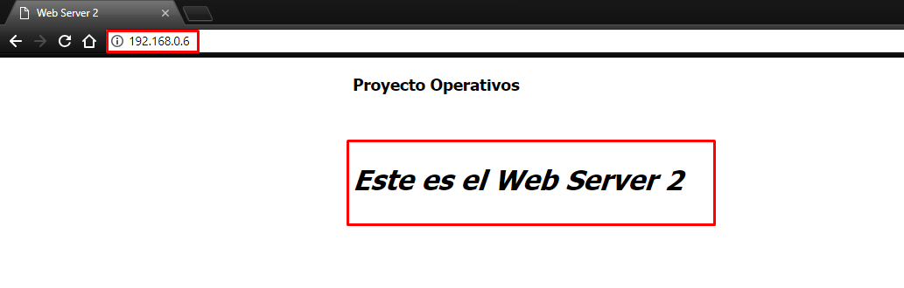

# Sistemas Operacionales - Proyecto final  
**Nombre:** Brayan Andrés Henao  - Jefry Cardona Chilito  
**Código:** A00056004 - A00320232  
**Correo:** bryanhenao96@gmail.com - jeffrykr95@gmail.com  
**URL Repositorio:** https://github.com/brayanhenao/so-project

## Máquina Virtual

### Instalación
Para este proyecto se utilizará una máquina virtual con el sistema operativo Ubuntu 16.04 LTS (Xenial). Para su instalación, se siguen estos pasos:

1. Primero se configura el hypervisor (VirtualBox en este caso) creando el disco duro, la memoria ram que le será asignada y el sistema operativo a utilizar, proporcionando la imagen ISO de este.  
  

  

  

  


2.  Una vez proporcionados los recursos, se inicia la máquina virtual y se empieza su instalación seleccionando el idioma del asistente de instalación y presionando el botón "Instalar".  

  

3.  Se selecciona "Descargar actualizaciones al instalar Ubunto" esto permitirá tener el sistema actualizado en su última versión.  


4.  Se procede a seleccionar el tipo de instalación, en este caso "Borrar disco e instalar Ubuntu" para que realice una instalación limpia en el disco desde 0.


5.  Se le pregunta al usuario cuáles son las particiones que se van a crear, y se presiona el botón continuar.


6.  Se configura la ubicación (Bogotá) y la distribución del teclado a utilizar (en nuestro caso Español latinoamericano).


7.  Por último se especifica el usuario a crear, al igual que el nombre del equipo y la contraseña de acceso a este.


### Configuración  
##### Núcleos  
Como se pide en el proyecto, se debe configurar la máquina virtual para que trabaje con 4 núcleos, así que procedemos a ir a la opción "Configuración" de la máquina virtual, en la pestaña "Sistema" y la subpestaña "Procesador".  

  

##### Interfaces de red  
Una vez instalado el sistema operativo se procede a realizar las configuraciones de red necesarias para el proyecto, habilitar las 2 interfaces de red necesarias para trabajar en el proyecto, una en modo NAT y la otra en modo Bridge (adaptador puente).  


## Instalación LXC/LXD  

Para la instalación de LXC/LXD para el usuario operativos se necesita el siguiente comando:

```console
sudo apt install lxd lxd-client
```

Una vez instalado LXC/LXD se procede a agregar al usuario operativos al grupo lxd, esto para que se puedan utilizar los comandos.
```console
usermod -a -G lxd operativos
```


Una vez se encuentra lista la herramienta LXC/LXD se procede a instalar ZFS con los siguientes comandos:
```console
sudo apt-get update
sudo apt-get install zfsutils-linux
```


##### ZFS 
ZFS gestor de volúmenes lógicos de código abierto y gratuito creado por Sun Microsystems. ZFS elimina del todo la administración de volúmenes. En vez de tener que crear volúmenes virtualizados, ZFS agrega dispositivos a una agrupación de almacenamiento. La agrupación de almacenamiento describe las características físicas del almacenamiento (organización del dispositivo, redundancia de datos, etc.) y actúa como almacén de datos arbitrario en el que se pueden crear sistemas de archivos. 

Ventajas

-Escalabilidad: Es un sistema de archivos de 128 bits capaz de gestionar zettabytes (mil millones de terabytes) de datos.  

-Máxima integridad: Todo lo que hace dentro de ZFS utiliza una suma de comprobación para garantizar la integridad de los archivos. Además, mientras ZFS está ocupado comprobando silenciosamente la integridad de sus datos, realizará reparaciones automáticas en cualquier momento que pueda.

-Drive pooling: Los creadores de ZFS hacen una analogìa de este sistema de archivos con la memoria RAM.  Cuando necesitas más memoria en tu computadora, pones otro stick y ya está.  Del mismo modo, con ZFS, cuando se necesita más espacio en el disco duro, se coloca otro disco duro y listo.  No hay necesidad de gastar tiempo particionando, formateando, inicializando, o haciendo cualquier otra cosa en sus discos - cuando necesite un "pool" de almacenamiento más grande, simplemente añada discos.

-RAID: ZFS es capaz de muchos niveles RAID diferentes, todo ello a la vez que ofrece un rendimiento comparable al de las controladoras RAID por hardware.  Esto le permite ahorrar dinero, facilitar la configuración y tener acceso a niveles RAID superiores que ZFS ha mejorado.

La arquitectura de funcionamiento de ZFS se puede apreciar a continuación:


##### Storage Pool
A diferencia de los sistemas de ficheros tradicionales que residen encima de un sólo dispositivo subyacente y por lo tanto requieren un gestor de volúmenes separado, ZFS se apoya en espacios de almacenamiento virtuales (virtual storage pools). Los espacios se construyen a partir de uno o más dispositivos virtuales, o vdevs (la forma al que se referencia cualquier tipo de dispositivo de almacenamiento, ya sea local o remoto). Un pool puede ser de tipo simple (uno o más vdevs sin redundancia), mirror (dos o más vdevs en pares, en modalidad espejo), o RAID Z (tres o más vdevs con paridad).


Siguiendo con la instalación, se configura LXD para su uso con el comando:
```console
sudo lxd ini
```
Este comando se encarga de las configuraciones iniciales para el manejo de contenedores tales como la creación del pool storage, ZFS pool y el tamaño del loop device.  


Una vez realizados estos pasos llegaremos a la configuración bridge de LXD, para esto se utilizan los valores predeterminados.  


Se utiliza el nombre "lxdbr0" para la interfaz bridge de LXD.  


Se configura la subnet mediante IPv4.  


Una red aleatoria fue seleccionada automáticamente.  


Se coloca la dirección IPv4 de la interfaz.  


Se coloca la máscara de la subred.  


Se configura la dirección inicial y final que el DHCP se encargará de manejar.  


Se configura el máximo de direcciones asignados por el DHCP.  


Por último se selecciona hacer NAT a todo el tráfico IPv4 de la interfaz.  


Aquí se puede apreciar la finalización exitosa del proceso de configuración de LXD.  


## Creación de contenedores con servicio web
Se requiere la creción de 2 contenedores los cuales tendrán un servicio web. Para iniciar con la creación, utilizamos la siguiente sintáxis de comandos.

```console
lxc launch <imagen del so del contenedor> <nombre del contenedor>
```
Así que procedemos a ejecutar este comando dos veces, indicando en cada uno de ellas la misma imagen SO (Ubuntu 16.04 Xenial) y definiendo el siguiente estándar para los nombres.

- Web Server 1 -> webServer1
- Web Server 2 -> webServer2

```console
lxc launch ubuntu:16.04 webServer1
```

```console
lxc launch ubuntu:16.04 webServer2
```

Una vez ejecutados los anteriores comandos, procedemos a verificar si los contenedores fueron creados exitosamente, listándolos con el siguiente comando.

```console
lxc list
```  
  

Cuando los contenedores se han creado, se procede a realizar las configuraciones necesarios para que ambos contenedores sean servidores web, esto se realiza aprovisionando el servidor web con [Nginx](https://www.nginx.com/).

#### Configuración Web Server 1
Se ejecuta el siguiente comando, el cual accede al contenedor webServer1 mediante la terminal, con permisos de sudo (administrador) para poder realizar cambios e instalación de paquetes y el usuario ubuntu (creado por defecto por lxc).

```console
lxc exec webServer1 -- sudo --login --user ubuntu
```
Procedemos a instalar los paquetes necesarios por Nginx.  
```console
sudo apt-get install nginx
```

Una vez instalados los paquetes, nos dirigimos a /var/www/html , directorio en el cual se aloja el servidor web, y editamos index.nginx-debian.html para poder identificar el servidor.  
```console
nano /var/www/html/index.nginx-debian.html
```  
  

  

Para validar que el servicio web de Nginx esté activo, utilizamos el siguiente comando.  
```console
systemctl status nginx.service
```


También se puede utilizar curl a la dirección ip del contenedor webServer1 (desde la máquina host) para verificar la resputa (html) de la página principal del servidor.  

```console
curl http://10.2.36.93
```  


Para finalizar, se configura el contenedor para que utilice un procesador con el siguiente comando.

```console
lxc config set webServer1 limits.cpu 1
```


#### Configuración Web Server 2
Se utilizan los mismos comandos que en el servidor 1, solo se cambia el contenedor al servidor web 2.

```console
lxc exec webServer2 -- sudo --login --user ubuntu
```
Procedemos a instalar los paquetes necesarios por Nginx.  
```console
sudo apt-get install nginx
```

Una vez instalados los paquetes, nos dirigimos a /var/www/html , directorio en el cual se aloja el servidor web, y editamos index.nginx-debian.html para poder identificar el servidor.  
```console
sudo nano /var/www/html/index.nginx-debian.html
```  
  

  

Para validar que el servicio web de Nginx esté activo, utilizamos el siguiente comando.  
```console
systemctl status nginx.service
```


También se puede utilizar curl a la dirección ip del contenedor webServer1 (desde la máquina host) para verificar la resputa (html) de la página principal del servidor.  

```console
curl http://10.2.36.34
```  


Para finalizar, se configura el contenedor para que utilice un procesador con el siguiente comando.

```console
lxc config set webServer1 limits.cpu 1
```


## Creación de contenedor con servicio de balanceo de carga
Se requiere la creción de un contenedor, el cual tendrá como fin ser un balanceador de carga, designado a dirigir el tráfico entranto hacia alguno de los dos servidores web previamente creados. Se define el siguiente estándar de nombres y se procede a ejecutar el comando de creación de un contenedor con LXC.

- Balanceador de carga -> balanceadorCarga

```console
lxc launch ubuntu:16.04 balanceadorCarga
```

Una vez ejecutado el anterior comando, procedemos a verificar si el contenedor fue creado exitosamente, listándolo con el siguiente comando.

```console
lxc list
```  


#### Configuración
Para la configuración del balanceador de carga se utilizan los mismos comandos iniciales previamente usados para aprovisionar los contenedores con Nginx

```console
lxc exec balanceadorCarga -- sudo --login --user ubuntu
```
Procedemos a instalar los paquetes necesarios por Nginx.  
```console
sudo apt-get install nginx
```

Una vez instalados los paquetes, nos dirigimos a /etc/nginx/conf.d/, directorio en el cual se se configurará el balanceador, creamos un archivo con nombre 'load-balancer.conf' y pegamos lo siguiente.
```console
cd /etc/nginx/conf.d/
sudo nano load-balancer.conf
```

```
upstream backend {
   server 10.2.36.93;
   server 10.2.36.34;  
}
server {
   location / {
      proxy_pass http://backend;
   }
}
```


En el apartado 'upstream backend' se colocan las direcciones IP de cada uno de los dos servidores web previamente creados, esto para que los conozca y pueda redirigir el tráfico a ellos.  

Una vez modificado este archivo, se procede a eliminar la carpeta 'default' de /etc/nginx/sites-enabled/ para que el balanceador no de como respuesta una página HTML sino que proceda a realizar el balanceo de la carga y redirección hacia alguno de los dos servidores web. 
```console
sudo rm -rf /etc/nginx/sites-enabled/default
```

Se reinicia el servicio de Nginx.
```console
sudo service nginx restart
```

Se valida que el servicio para conexion remota y el balanceador esten activos.
```console
systemctl list-unit-files --state=enabled | grep lxd
```  


**lxd-containers.service** -> Servicio de balanceador.  
**lxd.socket** -> Servicio para conexión remota.

## Contenedores creados y sus direcciones IP
Para listar los contenedores con sus respectivas IP se utiliza el siguiente comando.
```console
lxc list
```


## Pruebas funcionamiento balanceador
### Pruebas curl
Para probar el funcionamiento del balanceador se utiliza el comando curl hacia la dirección IP del balanceador de carga.

```console
curl http://10.2.36.234
```


### Pruebas de estrés
Para las pruebas de estrés hacia nuestro balanceador de carga, se utiliza [siege](https://www.joedog.org/siege-home/). Se instala con el siguiente comando.
```console
sudo apt-get install siege
```
Una vez instalado siege, se procede a empezar con las diferentes pruebas de estrés con la siguiente sintaxis de comandos.  

```console
siege -c <usuarios concurrentes> -t <tiempo en el que correrá> <ip destino>
```

Para el caso de las pruebas de este proyecto, se utilizarán 500 usuarios concurrentes, en un lapso de tiempo de 60 segundos, hacia la dirección ip del balanceador de carga (10.2.36.234)

```console
siege -c 500 -t 60s 10.2.36.234
```


##### Servidores Web con 64Mb  
Para las pruebas con 64MB de memoria, se limita la memoria a usar por los contenedores con los siguientes comandos.

```console
lxc config set webServer1 limits.memory 64MB
```
```console
lxc config set webServer2 limits.memory 64MB
```  

Y se ejecutan las pruebas.
```console
siege -c 500 -t 60s 10.2.36.234
```
  

##### Servidores Web con 128Mb
Para las pruebas con 128MB de memoria, se limita la memoria a usar por los contenedores con los siguientes comandos.

```console
lxc config set webServer1 limits.memory 128MB
```
```console
lxc config set webServer2 limits.memory 128MB
```  

Y se ejecutan las pruebas.
```console
siege -c 500 -t 60s 10.2.36.234
```
  

##### Servidores Web con 50% CPU
Para las pruebas con 50% de CPU, se limita la cantidad de CPU a usar por los contenedores con los siguientes comandos.
```console
lxc config set webServer1 limits.cpu.allowance 50%
```
```console
lxc config set webServer2 limits.cpu.allowance 50%
```  

Y se ejecutan las pruebas.
```console
siege -c 500 -t 60s 10.2.36.234
```
  

##### Servidores Web con 100% CPU
Para las pruebas con 100% de CPU, se limita la cantidad de CPU a usar por los contenedores con los siguientes comandos.

```console
lxc config set webServer1 limits.cpu.allowance 100%
```
```console
lxc config set webServer2 limits.cpu.allowance 100%
```  

Y se ejecutan las pruebas.
```console
siege -c 500 -t 60s 10.2.36.234
```
  

## Reenvio de puertos
Se configura el reenvio de puertos para que desde la máquina host se pueda acceder al servicio de balanceador de carga, esto mediante el reenvio desde el puerto 80 del guest hacia la IP del balanceador de carga provisto por LXC.  

Para configurarlo se utiliza el siguiente comando, el cual agrega a las IPTABLES la regla anteriormente comentada.

```console
sudo iptables -t nat -A PREROUTING -p tcp -m conntrack --ctstate NEW --dport 80 -j DNAT --to-destination 10.2.36.234:80
```



## Opcional
#### Preguntas ramdom
-¿Al reiniciar la máquina virtual en que estado quedan los contenedores?  
A apagar la máquina se envía a todos los contenedores una señal de apagado a la que tienen 30 segundos para responder haciendo un apagado limpio del contenedor. Después de eso, si el contenedor sigue funcionando, será terminado forzadamente por LXD. Al arrancar, todos los contenedores que estaban funcionando en el momento en que se apagó el sistema se volverán a arrancar.  

## Bibliografía

-https://www.howtogeek.com/175159/an-introduction-to-the-z-file-system-zfs-for-linux/
-https://docs.oracle.com/cd/E24842_01/html/820-2314/zfsover-2.html#scrolltoc
-https://wiki.illumos.org/download/attachments/1146951/zfs_last.pdf
-https://es.wikipedia.org/wiki/ZFS_(sistema_de_archivos)#Espacios_de_almacenamiento_(Storage_pools)
-https://discuss.linuxcontainers.org/t/host-os-shutdown-restart-graceful-shutdown-restart-of-lxd-containers/391
-https://www.joedog.org/siege-home/

